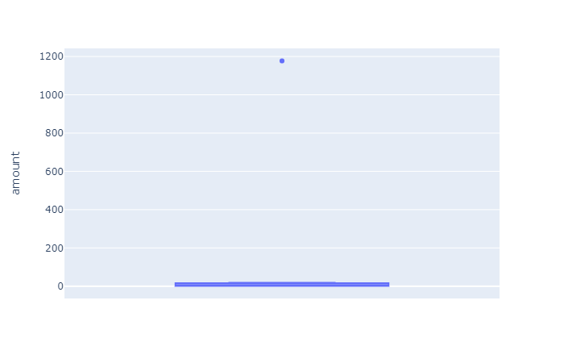
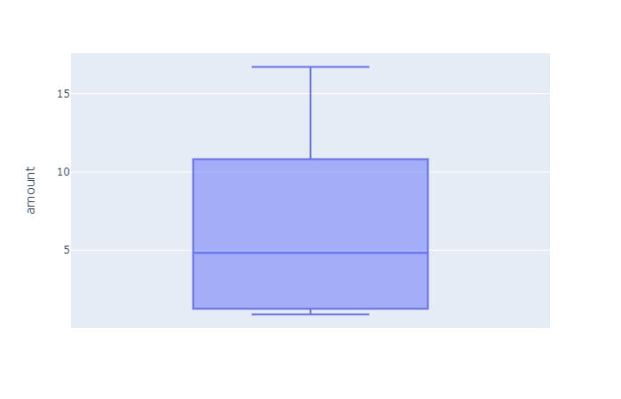
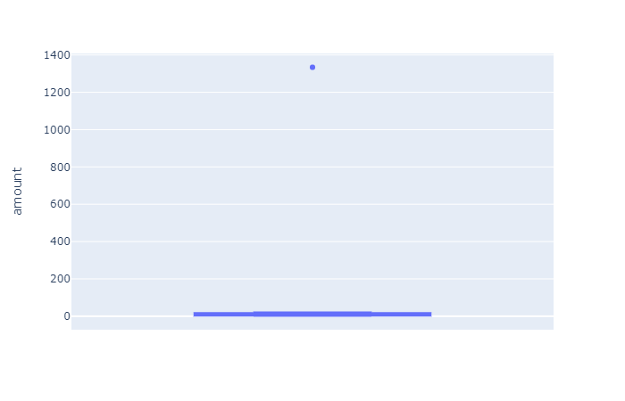

# Looking-for-Suspicious-Transactions

This report demonstrates the ability to discover anomalies among transaction to highlight activity that should be reviewed for suspicious transactoins.  

## Visual Analysis - Lineplot

The use of lineplots and boxplots provide a visual representation of an anomaly. The anomalies are represented by sudden spikes or dips which are inconsistent with linear progression. The following two graphs demonstrate transactionaly anomalies. 

### Cardholder 2 Lineplot

Cardholder 2 looks sporadic, but none of the spikes are abnormally high compared to the other spikes.

### Cardholder 18 Lineplot

Cardholder 18 clearly has abnormally spikes which require additional review for suspicious transactions.

### Cardholder 2 and 18 Lineplot

Combining the previous two graphs draws greater attention to the abnormally high price transactions by cardholder 18.

## Visual Analysis - boxplot

Using boxplots to visualize tranactional activity, suspicious transactions are identified by dots outside the box of the normal tranactional range. The farther away the dot from the box, the more abnormal the transaction.

When we review cardholder 25's monthly transactions, there are one to three tranactions per month that are outside our box of normal tranactions. These are the transactions we'd want to review for suspicious activity.

### Cardholder 25 January Boxplot

### Cardholder 25 Febuary Boxplot

### Cardholder 25 March Boxplot

### Cardholder 25 April Boxplot

### Cardholder 25 May Boxplot

### Cardholder 25 June Boxplot

### Cardholder 25 July Boxplot

## Systematic review

We can utilize python to create a systematic review process. The following document covers four different systematic approaches.

### Top 100 transactions

First we can sort a customers transaction by dollar amount, then review the largest tranactions. For cardholder 25 there are a dozen transaction that are over $200. We can then use the transaction id to reference the merchant table.

### Transactions below minimum threshold

The opposite of reviewing the largest transaction is review transaction below a minimum thershold to find suspicious transactions that are testing the account to be used fraudelently. Assuming a customer would rarely have transaction below $2, we can filter to all transaction below our threshold and we can even filter during a specific timeframe (in this example we review the time between 7am and 9 am). We can then use the transaction id to reference the merchant table. A coffee shop may not be suspicious, but an online company would be very suspicious.

### Transactions outside the standard diviation

Next we can caclute a standard diviation then create a list of transaction that a 2 sigmas outside the standard diviation. This list should provide similiar results as our maximum and mimimun lists. Once our list is created we can use the transaction id to reference the merchant table.

### Transactions outside the 25 and 75 quartiles

Finally we can use the quartile functionality to find the transaciton in the bottom 25 percentile or the top 25 percentile. The outter bounds should be similiar to those 2 sigmas outside the standard diviation.

## Databases utilized

Transactional Database reference tables:

.png)

