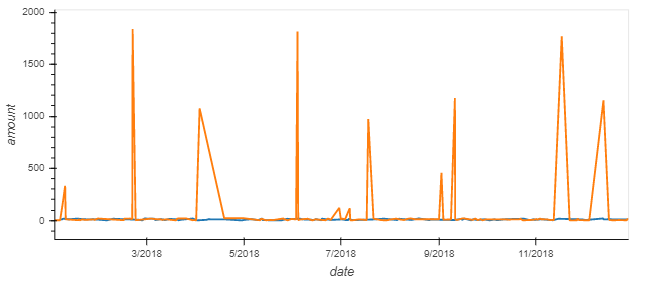
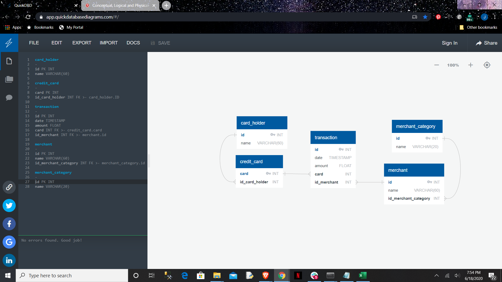

# Looking-for-Suspicious-Transactions

This report demonstrates the ability to discover anomalies among transaction to highlight activity that should be reviewed for suspicious transactoins.  

## Visual Analysis - Lineplot

The use of lineplots and boxplots provide a visual representation of an anomaly. The anomalies are represented by sudden spikes or dips which are inconsistent with linear progression. The following two graphs demonstrate transactionaly anomalies. 

### Cardholder 2 Lineplot

Cardholder 2 looks sporadic, but none of the spikes are abnormally high compared to the other spikes.

### Cardholder 18 Lineplot

Cardholder 18 clearly has abnormally spikes which require additional review for suspicious transactions.

### Cardholder 2 and 18 Lineplot

Combining the previous two graphs draws greater attention to the abnormally high price transactions by cardholder 18.

## Visual Analysis - boxplot

Using boxplots to visualize tranactional activity, suspicious transactions are identified by dots outside the box of the normal tranactional range. The farther away the dot from the box, the more abnormal the transaction.

When we review cardholder 25's monthly transactions, there are one to three tranactions per month that are outside our box of normal tranactions. These are the transactions we'd want to review for suspicious activity.

### Cardholder 25 January Boxplot

### Cardholder 25 Febuary Boxplot

### Cardholder 25 March Boxplot

### Cardholder 25 April Boxplot

### Cardholder 25 May Boxplot

### Cardholder 25 June Boxplot

### Cardholder 25 July Boxplot

## Systematic review

We can utilize python to create a systematic review process. The following document covers four different systematic approaches.

### Top 100 transactions

First we can sort a customer's transaction by dollar amount, then review the largest tranactions. For cardholder 25 there are a dozen transaction that are over $200. We can then use the transaction id to reference the merchant table.

        TransID     DateTimeStamp       Amount      MerchantID          MerchantName
*	  1415	  2018-01-30 18:31:00	$1177.00          64            Cline, Myers and Strong
*	  2840	  2018-03-06 07:18:09	$1334.00	  87	        Griffin-Woodard
*	  1341	  2018-04-08 06:03:50	$1063.00	  16	        Bryant, Thomas and Collins
*	  329	    2018-04-09 18:28:25	$ 269.00	  36	        Hamilton-Mcfarland
*	  1377	  2018-05-13 06:31:20	$1046.00	  48	        Baker Inc
*	  1790	  2018-06-04 03:46:15	$1162.00	  96	        Johnson-Fuller
*	  224	    2018-06-06 21:50:17	$ 749.00	  36	        Hamilton-Mcfarland
*	  2582	  2018-06-22 06:16:50	$1813.00	  40	        Cox, Montgomery and Morgan
*	  1877	  2018-08-16 10:01:00	$1001.00	  120	        Vega, Jones and Castro
*	  1863	  2018-12-18 13:33:37	$1074.00	  67	        Maxwell, Tapia and Villanueva

### Transactions below minimum threshold

The opposite of reviewing the largest transaction is review transaction below a minimum thershold to find transactions that are testing the account to be used fraudelently. Assuming a customer would rarely have transaction below $2, we can filter to all transaction below our threshold and filter down to a specific timeframe (in this example we review the time between 7am and 9 am). Then use the transaction id to reference the merchant table to review the suspicious transactions. A coffee shop purchase below $2 may not be fraudulent, but an online company charging less than $2 would be very suspicious.

Cardholder 25 has one transaction below $2 between the hours of 7am and 9am. Since there is only one over the year, this is very suspicious.

        TransID     DateTimeStamp           Amount      MerchantID      MerchantName
*	  640	    2018-10-08 08:18:57	    $1.74           95        	Baxter-Smith

Cardholder 19 has multiple transaction below $2 between the hours of 7am and 9am. Since there are multiple transaction below $2 during our timeframe, this maybe the customer's normal behavior, but we'd still want to inspect the merchants to see if small dollar transactions are expected for their type of business.

        TransID     DateTimeStamp           Amount      MerchantID      MerchantName
*	  631       2018-12-20 08:00:01	    $0.78 	    66        	Robles Inc
*	  2224      2018-06-07 07:07:22	    $1.62 	    114       	Greene-Wood
*	  564       2018-09-21 07:53:08	    $0.61 	    117       	Mitchell Group
*	  546       2018-09-24 08:19:07	    $1.89 	    132       	Pugh-Williams
*	  3462      2018-04-29 08:03:32	    $1.72 	    132        	Pugh-Williams

### Transactions outside the standard diviation

Next we can caclute a standard diviation then create a list of transaction that are 2 sigmas outside the standard diviation. This list should provide similiar results as our maximum and mimimun lists. Once our list is created we can use the transaction id to reference the merchant table.

As expected, cardholder 25's transactions include all of the top 10 transactions listed above, except the smallest one at $269.

### Transactions outside the 25 and 75 quartiles

Finally we can use the quartile functionality to find the transaciton in the bottom 25 percentile or the top 25 percentile. The outter bounds should be similiar to those 2 sigmas outside the standard diviation.

For cardholder 25, the quartile list of transactions outside the boundary increase to include the 11 and 12th largest transactions. If the goal is to create the largest list of abnormal transactions, the quartile is prefered over the standard diviation method at 2 sigmas, but the standard diviaition mathod could be lowered to only those transactions within 1 sigma which would increase the list of abnormal transaction.

## Databases utilized

Transactional Database reference tables utilized to connect transaction to the cardholder and merchant of the associated purchase.

QuickBDB file:

